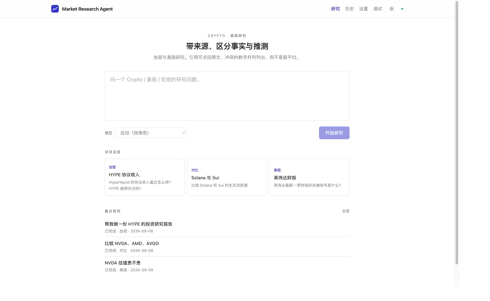
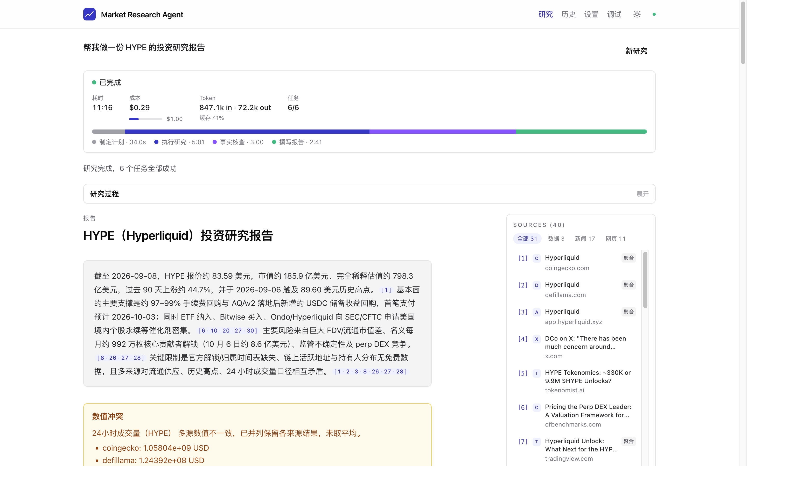
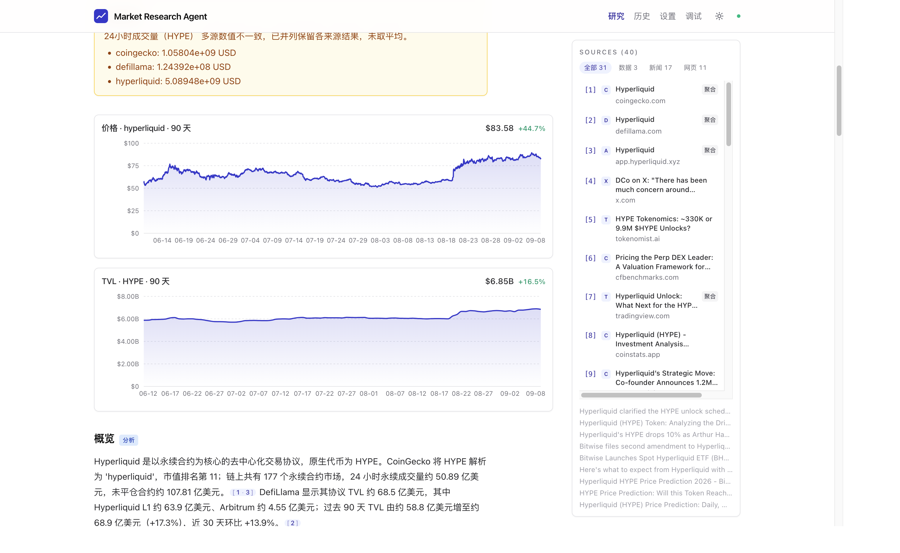
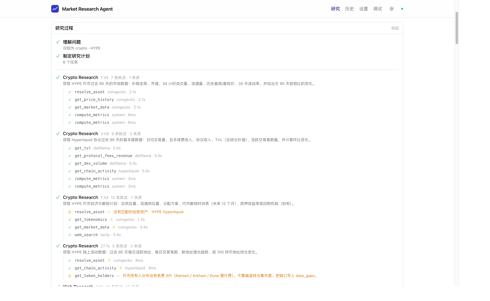
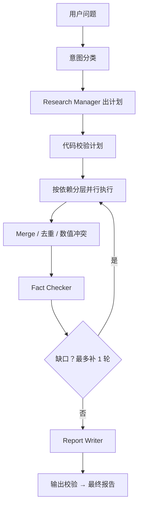

<p align="center">
  
</p>

<h1 align="center">Market Research Agent</h1>

<p align="center">
  <strong>个人用的 AI 金融研究平台。</strong><br>
  用自然语言提问，多 Agent 协作完成 Crypto 与美股研究，<br>
  产出带来源引用、区分事实与推测的结构化报告。
</p>

<p align="center">
  <a href="https://github.com/sunhaoxiang/market-research-agent/actions/workflows/ci.yml"></a>
  
  
  
</p>

不是又一个 ChatGPT 套壳。编排层是确定性 Python 代码，而不是 LLM 自己决定下一步；数字对不上就并列列出，缺数据就写进 `data_gaps`，而不是编一个看起来完整的答案。

```text
用户问题 → 研究计划 → 多 Agent 并行检索 → 事实核查 → 带来源的研究报告
```

当前状态：**MVP 已验收**（tag `v0.1.0-mvp`）。设计见 [`docs/DEVELOPMENT_PLAN.md`](docs/DEVELOPMENT_PLAN.md)，进度见 [`docs/ROADMAP.md`](docs/ROADMAP.md)。

---

## 界面预览

提问、看过程、读报告、核对来源，都在同一个控制台里完成。

**研究控制台** — 自然语言提问，示例卡片一键填入，最近研究可回看。



**结构化报告** — 摘要带来源角标，数值冲突单独成卡，右侧 40 条来源可按类型筛选。



**指标走势** — 价格 / TVL 等序列画成品牌色面积图，标题直接给出最新值与区间涨跌。



**研究过程** — 每个子 Agent 做了什么、调了哪些 tool、花了多久，全部展开可查。



---

## 项目亮点

- 6 个 Agent：规划、Crypto、美股、网页、事实核查、写作。规划与写作不配 tool。
- 编排在 Python（fan-out、并发、超时、重试、merge），不是 LLM 自主循环。
- 子 Agent 用 Agents-as-Tools，结果回到编排层再汇总。
- 来源 URL 由 tool 层收集；claim 标事实 / 分析 / 推测；缺口写 `data_gaps`。
- 多源数值冲突并列，不做平均。
- Fact Checker 只看 claims + sources；补研究最多 1 轮。

---

## 架构

两个进程，一条内网 SSE：

```text
Browser
   │  fetch + SSE
   ▼
Next.js  (apps/web)                 UI · BFF · 数据库唯一 writer
   │  HTTP + SSE（127.0.0.1）
   ▼
Python Agent Service  (services/agent)     无状态研究引擎
   │
   ▼
Agents → Tools → 外部 API
         LLM / CoinGecko / DefiLlama / FMP / SEC / Tavily
```


1. **编排是确定性 Python，不是 LLM 自主循环。** LLM 只做两件事：写出 `ResearchPlan`，以及在单个任务里调 tool 推理。并发、超时、降级全部由代码控制。
2. **子 Agent 用 Agents-as-Tools，不用 Handoff。** Handoff 会交出控制权且不返回；这里需要多路并行再汇总给核查与写作。
3. **Next.js 是数据库的唯一 writer。** Python 只产事件流；客户端断开后 Next.js 仍会把 run 收完，保证会话完整落库。

### 研究流程



意图分类把问题标成 crypto / stock / macro / compare / generic。执行层按任务依赖分层，同层 `asyncio.gather`。Fact Checker 只看 claims + sources（干净上下文），需要时再检索复核。补研究硬上限 1 轮，防止无限循环。

---

## Agent 与 Tool


| Agent | 职责 | Tools |
| --- | --- | --- |
| `research_manager` | 把问题写成 `ResearchPlan`（任务、依赖、分配） | 无 |
| `crypto_research` | 行情、代币经济、协议基本面、链上活动 | crypto · defi · onchain · system · web |
| `stock_research` | 报价、公司画像、财报、估值、SEC 文件 | stocks · financials · sec · system · web |
| `web_research` | 新闻、公告、网页正文 | `web_search` · `news_search` · `web_fetch` |
| `fact_checker` | 核对高影响陈述，可再检索 | `web_search` · `web_fetch` |
| `report_writer` | 长文 + `[n]` 引用；章节与免责由编排层对齐 | 无 |

不可信网页会包进隔离标签再给模型；来源与 `claim.source_ids` 由 `SourceCollector` 补全，不依赖模型抄 URL。

### Tool 一览


| 域 | Tools |
| --- | --- |
| Crypto | `resolve_asset` · `get_crypto_price` · `get_market_data` · `get_price_history` · `get_tokenomics` |
| DeFi | `get_tvl` · `get_protocol_fees_revenue` · `get_dex_volume` · `get_chain_overview` |
| 链上 | `get_chain_activity` · `get_token_holders` · `get_whale_activity` · `get_exchange_flow` |
| 美股 | `resolve_ticker` · `get_stock_quote` · `get_company_profile` · `get_stock_price_history` · `get_peers` · `compare_to_index` |
| 财报 | `get_income_statement` · `get_balance_sheet` · `get_cash_flow` · `get_growth_metrics` · `get_valuation_metrics` · `get_valuation_history` |
| SEC | `list_sec_filings` · `get_filing_section` · `get_xbrl_facts` · `get_earnings_summary` |
| Web | `web_search` · `news_search` · `web_fetch` |
| System | `compute_metrics`（波动率、涨跌等确定性计算，不交给模型） |

部分链上工具在免费数据源上会返回 gap（例如持仓分布），Agent 必须把缺口写进报告，而不是编造。

---

## 目录结构

```text
market-research-agent/
├── apps/web/                    Next.js 16：UI、BFF、Drizzle、唯一 DB writer
│   ├── app/                     页面与 Route Handlers
│   │   ├── page.tsx             研究控制台 `/`
│   │   ├── history/             历史列表
│   │   ├── settings/            模型与偏好
│   │   ├── debug/               运行埋点 / eval 调试
│   │   └── api/                 BFF：会话、SSE 转发、健康检查
│   ├── components/              报告、来源、研究过程、设置
│   ├── lib/                     会话状态、SSE、引用、主题
│   └── db/                      Drizzle schema、查询、migration
│
├── services/agent/              Python 3.13 FastAPI：无状态研究引擎
│   └── src/agent_service/
│       ├── api/                 研究流、tool invoke、debug
│       ├── orchestrator/        意图、规划校验、执行、合并、核查、写作
│       ├── agents/              上面 6 个 Agent 的构造与 prompt
│       ├── tools/               按域划分的 function tools + registry
│       ├── providers/           CoinGecko / DefiLlama / FMP / SEC / Tavily
│       ├── models/              多 Provider Model Registry
│       ├── schemas/             Pydantic：计划、发现、报告、事件（跨语言真源）
│       ├── sources/             来源归一、可靠性、引用编号
│       └── prompts/             各 Agent 的 markdown prompt
│
├── packages/shared/             从 Pydantic 生成的 TypeScript 类型（勿手改）
├── docs/                        设计文档、roadmap、README 截图
├── scripts/                     dev.sh、gen-types.sh
└── data/                        本地 SQLite（gitignore，不入库）
```

页面：`/` 研究控制台 · `/history` 历史 · `/settings` 设置 · `/debug` 调试。

---

## 快速开始

### 环境

| 工具 | 版本 | 说明 |
| --- | --- | --- |
| Python | 3.13 | `.python-version`（可用 pyenv） |
| uv | ≥ 0.9 | Python 依赖 |
| Node.js | 24 | `.nvmrc` |
| pnpm | 12.3 | 见根目录 `packageManager` |

至少配置一个 LLM key。Crypto 研究建议再配 Tavily + CoinGecko；美股财报主路径走 SEC EDGAR（需要合法 `SEC_USER_AGENT`），行情 / 估值需要 FMP。

```bash
# 1. 环境变量（至少填一个 LLM provider key）
cp .env.example .env.local

# 2. 安装依赖
pnpm install
(cd services/agent && uv sync)

# 3. 初始化数据库
pnpm db:migrate

# 4. 同时启动两个服务
pnpm dev
```

- Web：http://localhost:3000
- Agent Service：http://127.0.0.1:8000（OpenAPI 在 `/docs`）
- 健康检查：http://localhost:3000/api/health

数据库文件在仓库根的 `data/app.db`。`DATABASE_URL` 里的相对路径一律按**仓库根**解析。

### 常用命令

```bash
pnpm dev              # 同时启动 web + agent
pnpm dev:web          # 仅 Next.js
pnpm dev:agent        # 仅 Agent Service

pnpm check            # 全套检查（lint / typecheck / 单测 / 类型生成）
pnpm test             # Vitest
pnpm py:test          # pytest（默认跳过 live）

pnpm db:migrate       # 执行 migration
pnpm db:studio        # Drizzle Studio
pnpm gen:types        # Pydantic → JSON Schema → TypeScript
```

`pytest -m live` 会打真实外部 API 与 LLM，产生费用，默认跳过。

---

## 技术栈

| 层 | 选择 |
| --- | --- |
| Agent | Python 3.13 · OpenAI Agents SDK · FastAPI · Pydantic v2 · uv |
| 前端 | Next.js 16（App Router）· React 19 · TypeScript · Tailwind CSS 4 |
| 数据 | SQLite · Drizzle ORM |
| 工程 | pnpm workspace · Ruff · basedpyright · pytest · Vitest · ESLint · GitHub Actions |

### 约定

- **API key 只在服务端。** 不用 `NEXT_PUBLIC_` 承载任何 secret；浏览器不直连第三方数据源。
- **Pydantic 是跨语言类型的唯一真源。** 改了事件协议后跑 `pnpm gen:types` 并提交生成结果，CI 会检查漂移。
- **关键结论必须有来源，事实与推测必须分离。**

更完整的设计（模型角色、执行上限、引用完整性校验）在 [`docs/DEVELOPMENT_PLAN.md`](docs/DEVELOPMENT_PLAN.md)。

---

## 免责声明

本项目输出仅供个人研究参考，**不构成投资建议**。数据来自公开 API 与网页，可能滞后、口径不一或缺失；任何交易决策请自行核实原始来源。

## 许可

仓库公开，欢迎 Issue 与 Pull Request。目前尚未附加开源许可证文件。
